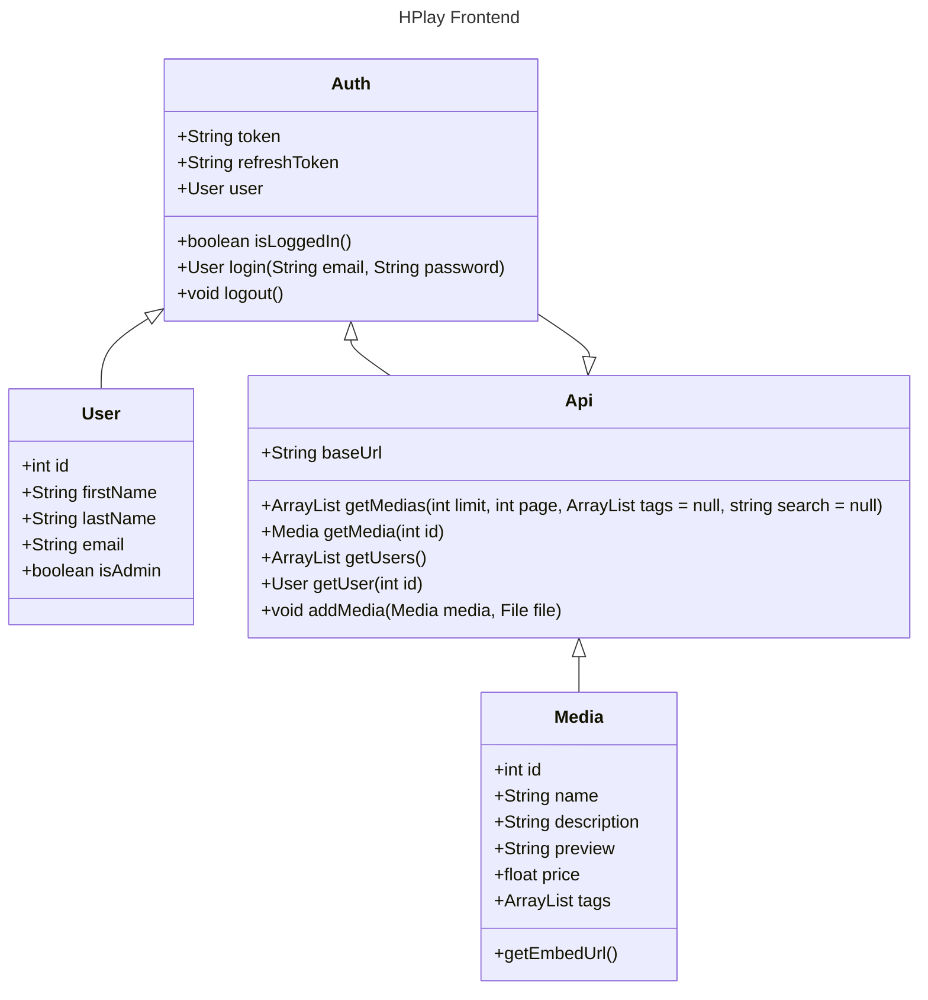

# Class Diagram

```mermaid
---
title: HPlay Frontend
---

classDiagram
    class Media {
        +int id
        +String name
        +String description
        +String preview
        +float price
        +ArrayList<String> tags
        +getEmbedUrl()
    }
    
    class User {
        +int id
        +String firstName
        +String lastName
        +String email
        +boolean isAdmin
    }
    
    class Auth {
        +String token
        +String refreshToken
        +User user
        +boolean isLoggedIn()
        +User login(String email, String password)
        +void logout()
    }
    
    class Api {
        +String baseUrl
        +ArrayList<Media> getMedias(int limit, int page, ArrayList<String> tags = null, string search = null)
        +Media getMedia(int id)
        +ArrayList<User> getUsers()
        +User getUser(int id)
        +void addMedia(Media media, File file)
    }
    
    Api <|-- Auth
    Api <|-- Media
    Auth <|-- User
    Auth <|-- Api
```